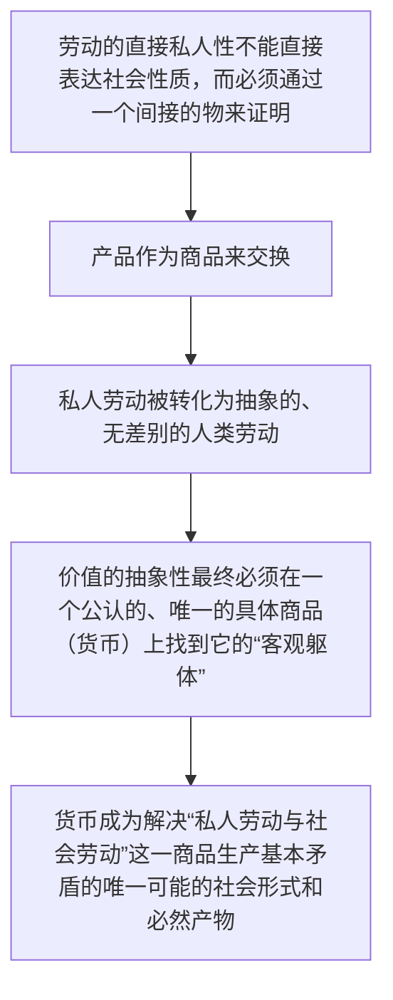

## 《新马克思阅读的开端》   汉斯-格奥尔格·巴克豪斯

区分作为科学家和哲学家的马克思与作为无产阶级世界观的宣扬者的马克思

将马克思视作经济-哲学综合的奠基者

提出：因此我们还需要“敞开”对马克思代表著作的理解,因为它只有在**黑格尔矛盾逻辑的基础**上,即**本质逻辑**之上才能被敞开

马克思的“方法”：在1858年4月2日的信中关于商品、货币以及建构“辨证过渡”到资本范畴的思考。认为提供了马克思价值理论独特的真实结构

所要解决的政治经济学批判问题：用“无内容性”这一关键词,要说的是现象的无内容性,我们因而又再度回到了“政治经济学上的怀疑论”这一主题上,也就是政治经济学的量和对象,以及政治经济学的“逻辑困境”和“方法论悲剧”的“不可理解”“不确定性”或者“无意义性”

---

*交换价值规律如何只是在自己的**对立物**中实现*

<mark>作为辨证矛盾的商品</mark>，是价值理论的核心话语

---

我对“二重化”范畴印象深刻,当我在《资本论》第-版,并且首先是在《马克思恩格斯著作集》的《大纲》之中看到这-范畴时,在我看来,它提供了理解马克思辩证法的一把主要的钥匙。和对当时还完全未知的价值形式分析的一些思考一起,我将其作为一篇关于马克思的专题报告的核心，这一报告是在阿多诺1964-1965年冬季学期的高级研讨课上作的。报告甚至记录都基本上和阿多诺的学生们预先讨论了;我向哈格讨教了，幸好他劝我打消了这一突发奇想,即商品一货币等式,以及使其结构化的二重化结构“反驳”了同一性原则。他建议我以这一表达取代前面的想法:这种等同是对“同一性原则的辩证扬弃”--阿多诺在表达这一观点时既非肯定也非批判。*

商品和货币之间的等式关系（即所有商品都与同一个特殊商品——货币——相等），以及支撑这个等式的二重化结构（商品世界分裂为普通商品和货币，，本身就构成了对传统形式逻辑的同一性原则的反驳。因为同一性原则要求事物与自身同一。但在这里，异质的商品通过被设定为与同一个第三物（货币） 相等，而被强行同一化了。这个等同的过程正是通过社会的二重化（分裂出货币）实现的。

---

在这一解释中,价值和交换价值的区别被给予的分量太低了。这是正确的。尤其是《资本论》第一版的“价值形式 IV”,它在第二版中消失了,介绍了一种前货币的价值形式,这种形式一方面被迫从“简单的(价值形式--译者注)”产生,另一方面还是具有一种困窘的、自我扬弃的结构;尽管这样,这种形式的复数性-“形式 IV”的一个多样性并没有被思考;它因而构成了一个消失了的量,凭借它的多样化它就消解了。这反过来意味着,前货币的商品的交换也没有被思考;这种前货币的商品的“交换过程”失败了,它在概念上是被决定的,正如在《资本论》第二章中所表明的。

**价值形式IV的实验，是为了解释为什么本质上不平等的实物交换，能催生出并要求一个象征“绝对等价”的东西——货币**

货币解决了“形式IV”的困境：它终结了价值尺度的混乱和多头并存，提供了一个唯一的、统一的价值尺度。没有货币，我们就会退回到“形式IV”所描绘的那种价值表现混乱、交换困难重重的状态。

因此，<mark>货币是价值形式内在矛盾发展的必然产物</mark>。它不是非历史地产生的，而是<u>商品生产社会中，人们的社会生产关系（通过劳动交换产品）被迫物化在一个外在物体上的结果。</u>货币的“必要性”不在于让每一次交换都“等价”，而在于<mark>它让“价值”这个概念本身得以在社会现实中成立和运转</mark>。

（此处涉及到新马克思阅读学派对于商品拜物教的严格历史限定，即只有在商品交换成为普遍活动的社会中，商品拜物教才可能产生）

---

马克思的“剩余价值”自然是个前货币的价值,而那种价值一般,其“一般的特征”与在一个“特定”商品中的“定在”是“矛盾的”,同样是一个前货币的价值。尽管如此,矛盾的“阐述”也不能够产生一种由交换价值设定的商品,而只能产生由价格设定的商品;前货币价值的“一般特征”完全不是“表现”在和实现在一种前货币的交换价值结构中,而是同时在一种货币的商品一货币结构中。前货币的价值一般不能实现于一个前货币的交换价值之中,但是在其自己独特的前货币特征中,它是最高限度的现实的。这种价值就是阿多诺意义上的“实在的存在体”(ens realissimum)①、“辩证的阐述”的动力,以及最终在资本的世界市场运动中实现的原则。

前货币的价值一般`并不实现在前货币的交换价值结构`（比如简单价值形式）中，而是实现在`商品—货币`结构中。也就是说，<mark>价值一般虽然在概念上是“前货币”的，但它只有在货币经济中才得到真正的社会实现</mark>。在巴克豪斯看来，`价值一般`是隐藏在商品交换现象背后的真实力量，同时也是资本全球扩张的内在原则。

抽象劳动必须通过具体物（货币）来表现的矛盾不能通过回到前货币的交换来解决，而只能在货币经济中展开（矛盾的展开）。`价值一般`是驱动整个体系的“实在的存在体”，在世界市场的资本运动中最终实现。

---

<big>**研究的主题：拜物教**</big>

拜物教问题的三个方面:

(1) 作为经济学研究对象的对象性的问题

(2) 作为其矛盾结构的问题,也就是作为统一和差异的问题

(3) 作为在非经验理论基础上所进行的分析

**问题：什么的对象性？**

主流经济学在根本上回避和失败了，因为它拒绝处理自身范畴（如价格）的“拜物教特征”，即它们是一种神秘的、主客观颠倒的“对象性形式”。

---

## 论价值形式的辩证法   汉斯-格奥尔格·巴克豪斯

起点：劳动价值理论

强调马克思价值理论的批判意图。并非完全“经济学的”

任务：重建价值形式理论的整体性

---

*在《资本论》的序言中马克思有力地警告说,如果忽视了价值形式学说的话，'而对资产阶级社会说来,劳动产品的商品形式，或者商品的价值形式,就是经济的细胞形式。在浅薄的人看来，分析这种形式好像是斤斤于一些琐事”①。包括李嘉图学派在内,“两千多年来人类智慧对这种形式进行探讨的努力,并未得到什么结果”@。从这一引文中可以看出,马克思在研究史上第一次要求认清这种“神秘的形式”*

将对这种理解的不足归因为马克思没有留下完整的劳动价值理论

---

*我认为，《资本论》中的叙述方式并不能够使马克思价值形式分析的认识论的主旨得到清晰的彰显,也就是这个问题，“为什么这内容采取这种形式”②。*

资本论中令读者印象深刻的为价值实体学说、劳动二重性学说。第三节价值形式学说没有被完全理解。

众多研究者忽视了劳动价值学说将货币作为货币来研究并在此基础上创立一个专门的货币理论的需求

*劳动价值理论的基本概念只有在他们把握了货币理论的基本概念之后才可以理解。 当商品在一个“内在超越自身”的过程中被设定为货币而被加以理解时,价值理论才可以被恰当地解释。商品和货币的这种内在联系,决定了不可能在接受马克思价值理论的同时拒绝与之结合在一起的货币理论。*

将价值理论和货币理论联系到一起来理解——从价值形式分析推出货币的产生

---

*在本文中,对拜物教性质的真正解释将以如下方式划分并加以研究:*

*1. 对于马克思来说,“物之间的社会关系”是如何构成的?*
*2. 为何以及在何种程度上“物的关系”只是作为“物本身以外的东西,它只是隐藏在物后面的人的关系的表现形式”?*
   
   *进一步的问题：*
   
a. “人的关系”被作为“私人劳动的社会关系”或者还是作为“生产者同总劳动(Gesamtarbeit)的社会关系”而被定义,如何理解“关系”和“总劳动”概念?

b. “社会关系”相对于意识必然“表现”为一个他者的基础是什么?

c. 什么构成了这一外观的真实性:这一现象自身以何种方式还作为现实的一个环节?
    
d.如何来把握抽象的价值对象性的形成过程:主体以何种方式“对象化”自身,将自身变作相对立的客体?

<big>问题：马克思是如何描述那种他称作“物之间的社会关系”的结构的?</big>

商品的交换是<u>内容上的等同，形式上的不等同</u>。

<mark>价值关系的结构：所有商品共同与一个独占了一般等价物地位的特殊商品（货币）发生关系，并通过这种关系来表现自身价值。

*马克思发现李嘉图主义者仅仅对价值量规定的基础感兴趣--“形式本身”对于他们来说“就是自然的、无关紧要的”③;经济学范畴“在政治经济学的资产阶级意识中……成了不言而喻的自然必然性”④*

马克思将“价值向交换价值或价格的‘过渡’” 本身当作了核心问题。他的形式分析意在揭示“究竟如何能够将一个商品在另一个商品之中或者将商品描述为等价物”，也就是在追问<mark>价值形式（从简单的物物交换比例到货币价格）的生成过程</mark>。这一形式并非外在的、可有可无的包装，而是价值本身的内在要求和必然产物。<u>抽象劳动的`社会性`必须在一种商品与另一种商品的价值关系（最终表现为货币关系）中才能得到表达和实现。</u>

**“物之间社会关系”的结构就是 “价值表现”的结构。核心是所有商品通过货币来实现社会等同。这一发现是通过将古典经济学忽略的 “价值形式” 作为核心议题来实现的。他证明了，`货币形式不是附加在价值之上的，它就是价值本身发展的完成形态`。不理解价值形式，就无法真正理解价值，也就无法穿透商品世界的拜物教迷雾。**

---

*对价值形式的逻辑结构的分析不能与对其历史社会内容的分析相分离。古典劳动价值理论却没有对那种作为“形成价值的”劳动的历史社会构造进行追问。*

李嘉图左派的困惑：为什么已经存在劳动价值这一内在尺度，还需要货币这一外在尺度。因此提出可以量化劳动时间作为交换的基础，空想的方案是：取消货币，让产品直接以劳动时间单位来计量和交换（例如发行“劳动券”）。

马克思：真正的问题不是“为什么有另一个尺度”，而是 “为什么劳动必须表现为价值？” 以及 “为什么价值必须通过另一种商品（货币）来表现？” 从而将问题从“量的尺度”引向了“质的形式”。因此，需要追问的是在商品生产中,劳动为何表现为产品的交换价值,表现为“它们所具有的某种物的属性”。

古典劳动价值论认为价值只是一个量的问题（价值由耗费的劳动时间决定），而对马克思来说，`价值首先不是关于量的，而是关于质的，是关于关系的`。

价值计算存在的隐蔽基础是生产范围的本质的矛盾：私人劳动和社会劳动的矛盾。

**三段追问：I.劳动为何要采取“价值”这一形式？(私人分工和社会化生产的矛盾，劳动被迫采取的一种间接的、迂回的社会化形式)→II.价值为何必须由货币来表现？（价值形式内在矛盾发展的必然结果，由“私人劳动与社会劳动”这一特定历史矛盾所强制规定的社会构造）→III.这种构造掩盖了什么？（剥削关系、社会生产的无政府状态）**

---

“不是又是一个东西”：商品和货币的关系（同一性定律的经济学扬弃）

货币作为货币被马克思规定为一个矛盾地建构起来的整体：直接地显现为它自身对立面的、一般物的特殊的东西

*同古典劳动价值理论不同,对马克思来讲，价值不只是价值量的决定基础,而首先是形成那种在其自我“中介的运动”中作为关系的关系的东西。因而价值对于马克思来讲不是一个在毫无特点的僵死性中的一个无运动的实体,而是一个自身在差异性中展开的东西:主体。*

>**“价格形式”的完成过程：**
>根源：所有其他商品的价值，共同将黄金推上了**货币**的王座。
>结果/颠倒：一旦黄金成为货币，商品的价值就不再直接表现为与其他商品的关系，而是观念地表现为一定数量的黄金，即它的价格。
>例如，一件上衣的价值，不再直接说它等于20码麻布，而是说它“值1克黄金”。

“中介运动” 指的是价值形式漫长的历史发展和逻辑演进过程（从简单的物物交换到货币的产生）。这个复杂的、充满社会矛盾的过程，在它的最终结果（价格） 中，完全看不见了。

价值对马克思来说不是实体而是主体（具有黑格尔色彩）。价值不是一个被动的“物”，而是一个能动的、有生命力的“过程”。它有一种内在的、必然的驱动力，要为自己寻找一个适当的表现形式（从简单价值形式到货币形式），并在这个运动中实现和证明自己的社会存在。整个商品世界的运动（交换、流通），都可以被看作是价值这个“主体”为了实现自身而展开的舞台。

*但是,流通的全程就其本身来看,就在于,同一交换价值,作为主体的交换价值,一次作为商品出现,另一次作为货币出现,并且它正是这样的一种运动,在这种运动中它在这两个规定上出现,在每一个规定上都作为这一规定的对立面保存自己,即在商品上作为货币,在货币上作为商品保存自己。*

*不言而喻,商品向商品和货币的二重化,只有在`物的这种对抗性的联系被表达为一种人的联系`的时候--这种人的联系以同样的方式处于一种对抗性之中--才可以得到解释。反过来讲,这种“人的社会关系”只有被如此规定,即从其`结构`来理解对抗性的“物的关系”。*

---

价值形式的分析对于马克思的社会理论的三个方面意义：

- 社会学和经济理论的结合点

- 开创了马克思的意识形态批判

- 开创了一种特殊的货币理论（确立了`生产领域对于流通领域的优先性`，并确立了生产关系对于上层建筑的优先性

## 其他材料

- >单凭“颠倒的逻辑”无法推出货币的生成,货币的生成还需要“排挤的逻辑”来得到说明。([价值形式理论与货币的生成逻辑——从马克思到宇野学派的价值形式理论演进史评析](https://kns.cnki.net/kcms2/article/abstract?v=hQtzIo_70oH9HGY16p03D18tt5qSCt5ghOQURgtaxE2mhWpIKoZzSzL0gNGWAbsV3nrRcVPl0_PyE2drwMzytJSoiMBRsLGXnEBFzcAMsbWxximLV5RrwNy7xmLJx85uQv5tZfIZKDRrr0OpX2liivsLbPVvKe1Eq8_PdGML-9SppSlf7_3i3w==&uniplatform=NZKPT&language=CHS))

- >《资本论》第一版的“价值形式 IV”,它在第二版中消失了,介绍了一种前货币的价值形式,这种形式一方面被迫从“简单的(价值形式--译者注)”产生,另一方面还是具有一种困窘的、自我扬弃的结构;尽管这样,这种形式的复数性-“形式 IV”的一个多样性并没有被思考;它因而构成了一个消失了的量,凭借它的多样化它就消解了。这反过来意味着,前货币的商品的交换也没有被思考;这种前货币的商品的“交换过程”失败了,它在概念上是被决定的,正如在《资本论》第二章中所表明的。(《新马克思阅读的开端》，巴克豪斯)

    说明：《资本论》第一版中这个被删去的特殊价值形式（形式IV）证明了在逻辑上完全自洽的“前货币”的价值形式是不可能的，从而逻辑预演了货币产生的必然性。形式IV之所以自我消解，正是因为它的多样性破坏了价值本质要求的统一性，也就是从一般价值形式向后倒退。它的自我扬弃和失败证明价值的社会性要求一个唯一的、稳定的价值表现尺度，这一结果也就是货币。

- >中介运动在它本身的结果中消失了，而且没有留下任何痕迹。(《马克思恩格斯文集，第五卷》)

- >前苏联哲学家鲁宾(Isaak Rubin)早在上世纪20年代的《论马克思的价值理论》一书中就主张：商品拜物教和工资形式并非仅仅是一个表象和欺骗,物与物之间商品拜物教的幻象形式的意义也并非在于其隐藏了真实的社会关系,实际上它正是<u>资本主义社会关系得以成为可能的条件</u>,或者说在资本主义社会,人与人的社会关系<u>不得不表现为以货币为中介的物与物的社会关系</u>。（[《资本论》与抽象统治:当代价值形式学派的贡献与反思](https://kns.cnki.net/nzkhtml/xmlRead/xml.html?pageType=web&fileName=XDZI201506001&tableName=CJFDTOTAL&dbCode=CJFD&fileSourceType=1&appId=KNS_BASIC_PSMC&invoice=ZAMUrUvsu4BUoBa7W7app5iZhMCARIvY5tUQyHGJ8uUNbRWsvQtEaQR1+tvKrwBeEvZTlVll+MrM5S9oEEFwZyoBwo6N0OqxkhYfZ6H30wLgys35L1NvhtO+ImcWwJr62xPMKvPGMXw69rGqA5ev8I0+61ySsyN9btCGlRkbyfI=)）

- >齐泽克在 《意识形态的崇高客体》中,从意识形态的视角,再次认为马克思在 《资本论》中颠覆了形式与内容关系的传统解读思路,清晰地阐明了商品形式本身所具有的重要意义。在他看来,<mark>形式不再是对内容的彰显和反映,它本身统摄和创构了内容本身</mark>。古典政治经济学和传统马克思主义试图发现商品形式或价值形式背后隐蔽内核的做法,反而错过了形式自身的秘密。因为 “关键在于避免对假定隐藏在形式后面的 ‘内容’的完全崇拜性迷恋: 通过分析要揭穿的 ‘秘密’ 不是被形式( 商品的形式、梦的形式) 隐藏起来的内容,而是这种形式自身的 ‘秘密’”。<u>在齐泽克看来,马克思和古典政治经济学家的根本性差异,就在于马克思《资本论》第一版序言中就明确指出,他的主要目的并非是要揭示隐藏在商品形式背后的人类劳动的内容和商品价值量背后的劳动时间的内容,而是要提示`商品形式`这个几千年来看似简单,却从未得到真正解答的未解之谜。</u>
    >在齐泽克看来,古典政治经济学家的问题在于研究方法的问题,导致痴迷于对劳动时间这一隐藏在商品形式背后的内容的迷恋,而忘记去探究商品形式这一资本主义经济细胞形式自身的秘密。但马克思认为这是由于他们资本主义辩护士的立场所决定了的,以至于只停留于价值,而不探讨价值成为价值的社会历史形式。
    >[鲁绍臣;.《资本论》与抽象统治:当代价值形式学派的贡献与反思[J].现代哲学,2015,(06):](https://kns.cnki.net/nzkhtml/xmlRead/xml.html?pageType=web&fileName=XDZI201506001&tableName=CJFDTOTAL&dbCode=CJFD&fileSourceType=1&appId=KNS_BASIC_PSMC&invoice=ZAMUrUvsu4BUoBa7W7app5iZhMCARIvY5tUQyHGJ8uUNbRWsvQtEaQR1+tvKrwBeEvZTlVll+MrM5S9oEEFwZyoBwo6N0OqxkhYfZ6H30wLgys35L1NvhtO+ImcWwJr62xPMKvPGMXw69rGqA5ev8I0+61ySsyN9btCGlRkbyfI=)

