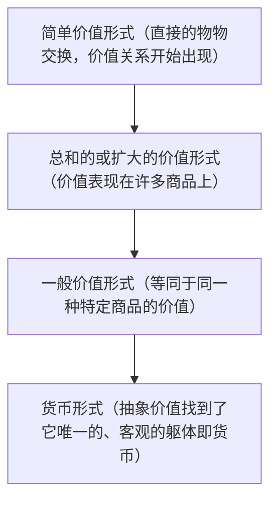

<font face=宋体>

# 想法

核心：拜物教。

- 价值形式分析学派对于拜物教的历史性限定是十分严格的，认为只有在资本主义社会中才存在商品拜物教，因为只有在资本主义社会中，商品才成其为商品，有了广泛的商品交换的需要。

- 马克思的商品拜物教。新马克思阅读的核心问题：拜物教。从形式出发进行拜物教批判的必要性（问题的产生）

- 相对于古典政治经济学来说，马克思的政治经济学批判更加围绕着`社会性`的问题展开，这一发现是通过将古典经济学忽略的价值形式作为核心议题实现的。从社会性推出形式分析，进而进入拜物教批判。

- 私人劳动的社会化过程——交换——货币产生的必要性

- 价值的形式的三重递进：物的形式（对具体劳动的抽象而得到的劳动的等同性）到价值量的形式（劳动持续时间来计量的劳动消耗）​，最终落脚到社会关系的形式（劳动的社会规定）。价值的本质的真正意义恰恰在于第三个抽象，即`社会关系的形式`。而这是马克思对于价值学说的独一无二的贡献所在。

- **马克思的主要工作：从价值量的形式推导社会关系的形式**。完成方式：马克思对价值形式的历史性分析。

- 从古典政治经济学的劳动价值论的悖论的解决出发，用`社会必要劳动时间的概念`来解决。而使用`社会`必要劳动时间时，就说明了劳动时间的`社会化`是商品“价值形式”的最终决定性要素。

- 价值是 “形成那种在其自我‘中介的运动’中作为关系的关系的东西” ：

    - 价值不是一个孤立的实体，而是一个运动过程，一个关系性的活动。

    - 它是在商品与商品之间相互比较、相互衡量、相互表现的“中介运动”中，才生成和确立了自身作为一种社会关系的存在。

    - 换句话说，`价值本身就是一种关系，而不是先有关系再有一个叫“价值”的东西`。

## 形式与内容关系的思路

>齐泽克在 《意识形态的崇高客体》中,从意识形态的视角,再次认为马克思在 《资本论》中颠覆了形式与内容关系的传统解读思路,清晰地阐明了商品形式本身所具有的重要意义。在他看来,<mark>形式不再是对内容的彰显和反映,它本身统摄和创构了内容本身</mark>。古典政治经济学和传统马克思主义试图发现商品形式或价值形式背后隐蔽内核的做法,反而错过了形式自身的秘密。因为 “关键在于避免对假定隐藏在形式后面的 ‘内容’的完全崇拜性迷恋: 通过分析要揭穿的 ‘秘密’ 不是被形式( 商品的形式、梦的形式) 隐藏起来的内容,而是这种形式自身的 ‘秘密’”。<u>在齐泽克看来,马克思和古典政治经济学家的根本性差异,就在于马克思《资本论》第一版序言中就明确指出,他的主要目的并非是要揭示隐藏在商品形式背后的人类劳动的内容和商品价值量背后的劳动时间的内容,而是要提示`商品形式`这个几千年来看似简单,却从未得到真正解答的未解之谜。</u>
>在齐泽克看来,古典政治经济学家的问题在于研究方法的问题,导致痴迷于对劳动时间这一隐藏在商品形式背后的内容的迷恋,而忘记去探究商品形式这一资本主义经济细胞形式自身的秘密。但马克思认为这是由于他们资本主义辩护士的立场所决定了的,以至于只停留于价值,而不探讨价值成为价值的社会历史形式。
>[鲁绍臣;.《资本论》与抽象统治:当代价值形式学派的贡献与反思[J].现代哲学,2015,(06):](https://kns.cnki.net/nzkhtml/xmlRead/xml.html?pageType=web&fileName=XDZI201506001&tableName=CJFDTOTAL&dbCode=CJFD&fileSourceType=1&appId=KNS_BASIC_PSMC&invoice=ZAMUrUvsu4BUoBa7W7app5iZhMCARIvY5tUQyHGJ8uUNbRWsvQtEaQR1+tvKrwBeEvZTlVll+MrM5S9oEEFwZyoBwo6N0OqxkhYfZ6H30wLgys35L1NvhtO+ImcWwJr62xPMKvPGMXw69rGqA5ev8I0+61ySsyN9btCGlRkbyfI=)

# 主题：由价值形式分析走向拜物教批判

拜物教批判是如何从价值形式分析中产生的

马克思通过价值形式分析，完成了政治经济学批判的理论革命：他将经济学问题的重心从价值的“量”（古典劳动价值论所关注的价值量由多少劳动决定）转向了价值的“形式”（为何劳动必须表现为价值），并由此揭示了拜物教并非一种纯意识形态的颠倒的错觉，而是资本主义社会的必然的、客观的思维与现实结构。

### 价值形式学派的总学术问题

将马克思的《资本论》重新解读为一部关于“现代社会的客观建构形式”的批判理论。 

## 由价值形式分析走向拜物教批判何以成为真问题

<small>批判理论的任务是建立一种诊断资本主义的病理学。资本主义的核心特征就是其各种悖论性的、幽灵般的表现形式（如德里达所描述的）。不能像庞巴维克那样因为这些东西不符合庸俗的理性标准，就简单地将其斥为“神话”并拒绝思考。恰恰相反，批判理论必须认识到，这个神话就是我们所处的现实本身。真正的理论工作不是否定这个神话般的现实，而是去解释这个真实的神话如何通过商品、货币和资本的社会形式被生产出来。</small>

>价值，在其本性上意味着一种“关系”​。它是一种比较的结果。当一个物被指认为“有价值”的时候，它就已经被抛入到一种“交换”之中。由此，商品的价值就意味着被抛入交换中的物与物之间所形成的固定的关系。这种固定的关系，在马克思的分析中表现为一种历史性的形成过程。首先，价值并非是物所固有的存在，它是在历史的过程中逐渐形成的一种抽象。因此，在这种抽象过程中，最为重要的不是价值量究竟该如何核定的（即价值的内容）问题，关键的问题在于“价值的形式”是如何一步步由具体的、偶然的形式发展到相对的、一般的形式（夏莹，拜物教的幽灵）

价值形式学派的核心目标：将政治经济学批判的重点放在价值形式上，从历史地考察价值形式的产生出发来重建价值形式的辩证法，同时尝试分析价值形式的社会构成，发展对价值形式等政治经济学范畴的批判，从而延续法兰克福学派的传统，为社会批判理论进一步奠定政治经济学的基础。

(价值形式是价值的表现形式，而价值的质则是一定的社会关系。资本主义社会结构内在的矛盾性，使其必然以价值形式的完成形式即货币形式表现出来，这一过程即二重化。)

>神秘的不是世界是怎样的，而是它是这样的。

**拜物教批判在总问题中的位置**：现象学入口与批判结论

起点：莱希尔特在《从法兰克福学派到价值形式分析》中点出对资本分析的起点是物化。

结论：通过价值形式分析成功地推导出货币的必然性、法权形式的衍生性、以及资本的内在矛盾后，对拜物教的理解就不再仅仅是关于商品的幻觉，而是整个资本主义客观社会形式的自我神秘化。

价值形式学派通过价值形式分析，试图构建一个对资本主义社会从经济基础到上层建筑的、统一的、由形式决定的批判理论。这一进路表现为：价值形式分析→拜物教批判→资本主义法权与统治形式批判→重构危机理论。

## 马克思的起点：对古典政治经济学的批判

价值的形式在马克思那里包含着三重含义：物的形式、价值量的形式、社会关系形式。

国民经济学家完成了从物的形式到价值量的形式的飞跃，而马克思则通过对价值形式的历史性分析完成了从价值量的形式到社会关系形式的飞跃。

古典政治经济学发现了价值的“实体”是劳动，提出价值的“量”由劳动时间决定，但是缺乏对那种作为“形成价值的”劳动的历史社会构造进行追问。李嘉图左派的困惑在于：为什么已经存在劳动价值这一内在尺度，还需要货币这一外在尺度。因此提出可以量化劳动时间作为交换的基础，空想的方案是：取消货币，让产品直接以劳动时间单位来计量和交换（例如发行“劳动券”）。

马克思指出，真正的问题不是“为什么有另一个尺度”，而是 “为什么劳动必须表现为价值？” 以及 “为什么价值必须通过另一种商品（货币）来表现？” 这就将问题从“量的尺度”引向了“质的形式”。因此，需要追问的是在商品生产中,劳动为何表现为产品的交换价值,表现为“它们所具有的某种物的属性”，从而将问题转换为价值形式（从简单的物物交换比例到货币价格）的生成过程。**价值形式分析的起点**。

马克思超越古典劳动价值论的方面正在于他将`社会性`作为问题的核心来解决。古典经济学家之所以无法看到‘价值形式’的重要性，是因为他们忽视了价值的社会性。马克思通过将劳动时间改写为社会必要劳动时间解决了这个悖论：决定价值的，不是个别的劳动时间，而是社会必要劳动时间，从而将价值的本质确立为一种`社会关系`。劳动时间的社会化是商品“价值形式”的最终决定性要素。商品的价值形式，作为价值之为可能的一种说明，由此只能指向一种社会关系的形式。

社会必要劳动时间的概念解决了问题中的本体论部分，回答了价值究竟是什么的问题。价值不是物，而是一种实体是抽象人类劳动的对象性。 只有先确立了价值的这种社会本体，对价值形式的分析和对拜物教的批判，才有了坚实的地基。从此，政治经济学的核心问题，从‘如何计量’转向了‘如何显现’。”

## 价值形式分析从量到形式的推导

价值作为一种社会的、抽象的本质，必须通过一个可感的具体形式来自我表现。

表现商品交换关系的价值形式的四个阶段：



形式IV的实验

>《资本论》第一版的“价值形式 IV”,它在第二版中消失了,介绍了一种前货币的价值形式,这种形式一方面被迫从“简单的(价值形式--译者注)”产生,另一方面还是具有一种困窘的、自我扬弃的结构;尽管这样,这种形式的复数性-“形式 IV”的一个多样性并没有被思考;它因而构成了一个消失了的量,凭借它的多样化它就消解了。这反过来意味着,前货币的商品的交换也没有被思考;这种前货币的商品的“交换过程”失败了,它在概念上是被决定的,正如在《资本论》第二章中所表明的。

《资本论》第一版中这个被删去的特殊价值形式（形式IV）证明了在逻辑上完全自洽的“前货币”的价值形式是不可能的，从而逻辑预演了货币产生的必然性。形式IV之所以自我消解，正是因为它的多样性破坏了价值本质要求的统一性，也就是从一般价值形式向后倒退。它的自我扬弃和失败证明价值的社会性要求一个唯一的、稳定的价值表现尺度，这一结果也就是货币。这一“删除”的结果还说明，单凭“颠倒的逻辑”是无法推出货币的生成的,<mark>货币的生成还需要“排挤的逻辑”来得到说明</mark>。

<font face=楷体>单凭“颠倒的逻辑”无法推出货币的生成,货币的生成还需要“排挤的逻辑”来得到说明。[价值形式理论与货币的生成逻辑——从马克思到宇野学派的价值形式理论演进史评析](https://kns.cnki.net/kcms2/article/abstract?v=hQtzIo_70oH9HGY16p03D18tt5qSCt5ghOQURgtaxE2mhWpIKoZzSzL0gNGWAbsV3nrRcVPl0_PyE2drwMzytJSoiMBRsLGXnEBFzcAMsbWxximLV5RrwNy7xmLJx85uQv5tZfIZKDRrr0OpX2liivsLbPVvKe1Eq8_PdGML-9SppSlf7_3i3w==&uniplatform=NZKPT&language=CHS)</font>

## 拜物教批判的问题产生

价值形式的构成性权力产生了前资本主义社会与资本主义社会最根本的差别

>中介运动在它本身的结果中消失了，而且没有留下任何痕迹。(《马克思恩格斯文集，第五卷》)

价值形式漫长的历史与逻辑演进（中介运动），在它的最终结果即价格中完全消失了。即，过程消失以后，只留下了现成的、看似自然的结果。

通过价值形式分析可以发现，在资本主义社会里，人与人之间的社会劳动关系（私人生产者之间的相互依赖），别无他法，只能通过物与物（商品与货币）的关系来呈现和运作。因此，拜物教中“人与人的关系被物与物的关系所取代”并不是单纯的意识形态错觉，而是经由价值中介以后必然存在的客观形式。前苏联哲学家鲁宾(Isaak Rubin)早在上世纪20年代的《论马克思的价值理论》一书中就主张：商品拜物教和工资形式并非仅仅是一个表象和欺骗,物与物之间商品拜物教的幻象形式的意义也并非在于其隐藏了真实的社会关系,实际上它正是<u>资本主义社会关系得以成为可能的条件</u>,或者说在资本主义社会,人与人的社会关系<u>不得不表现为以货币为中介的物与物的社会关系</u>。（[《资本论》与抽象统治:当代价值形式学派的贡献与反思](https://kns.cnki.net/nzkhtml/xmlRead/xml.html?pageType=web&fileName=XDZI201506001&tableName=CJFDTOTAL&dbCode=CJFD&fileSourceType=1&appId=KNS_BASIC_PSMC&invoice=ZAMUrUvsu4BUoBa7W7app5iZhMCARIvY5tUQyHGJ8uUNbRWsvQtEaQR1+tvKrwBeEvZTlVll+MrM5S9oEEFwZyoBwo6N0OqxkhYfZ6H30wLgys35L1NvhtO+ImcWwJr62xPMKvPGMXw69rGqA5ev8I0+61ySsyN9btCGlRkbyfI=)）


## 价值形式学派相对于此前的拜物教批判理论的区别

```
卢卡奇：物化理论，着眼于生产领域与主观意识的物化
索恩·雷特尔：基于新康德主义认识论，意识到交换行为中的“现实抽象。其批评重心在于纯粹理性与商品形式的同源，提出的解决方案是揭示认识范畴的社会根源
价值形式学派：通过系统的价值形式辩证法分析，推论出价值必须通过等价物形式表现，批判价值形式本身的自我神秘化，从而揭示并超越商品生产形式
```


# 最后的问题

巴克豪斯在他的叙述中将马克思的在特定时代语境下的分析挪用到了当前的时代，这个挪用是怎么产生的？对于价值形式分析学派所引用的马克思的文本和当代的政治经济学现象之间可以作出怎样的区分？

对“资本是一种关系性存在的理解”

</font>