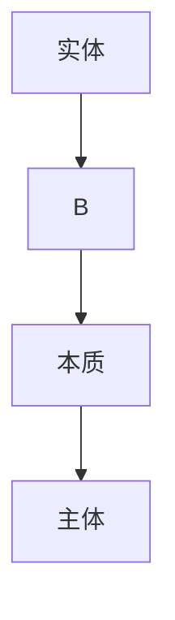

# 黑格尔《逻辑学》笔记

<font face=宋体>

## 目录部分

1. 黑格尔哲学的框架：否定之否定的进路。形式上表现为三三制。

## 第三版序言

英国的契约论模式：强调的不是普遍意志，而强调的是公意/共意。国家决策依靠多数人投票，民主没有代表普遍人的意见。（民主模式一定是善政吗？）

英法模式的基础都是**契约论模式**

普遍意志只有在绝对精神中实现→世界精神从自身出发不断外化、对象化、现实化的过程。

现实的政治模式：奥地利模式。君主立宪。不同于英国：君王的权力大于英王。半虚半实。

德皇希望通过专制政治将德意志建设为真正的帝国。

## 导论

1. 哲学的研究对象/研究方法不清晰   清晰的研究对象/研究方法将从哲学独立出去

2. 哲学将对象（有限性）当作自己的前提，并且要回到对象中。神学认为自身是有限性的前提。在这个意义上，神学就是主观观念论。

    >神学：有限性是阻碍我们到达无限性的障碍。从绝对出发回到绝对，有限是妨碍它回到绝对的。
    >观念论：感官是不可靠的，应当剔除经验

    黑格尔做的突破：同情经验主义，重新思考经验、有限性、特殊性等范畴。将柏拉图以来的观念论

    在认识论上之所以会出现这样那样的悖论，正是因为没有正确处理经验与超验、有限性与无限性等范畴的关系，因为独断论`非此即彼，非黑即白，非真即假`的认知。

辩证法是思维革命。

3. 哲学首先是对象化的，而对象化的方式是（概念/表象）。表象先于概念，是认识活动的前提、本原、基础、来源，没有这些前提就不会获得概念。

4. 黑格尔对开端的要求：普遍有效、具体规定

    （1）开端需要具有普遍性。开端需要`自身成为自身`，而非需要其他事物为自身做证明。只能自证不能他证/

    （2）开端需要有具体规定，否则开端就是一个空无。

    产生矛盾：形而上学的矛盾。跳出逻辑二元对立的思维，建立一种新的思维方法（辩证法）。辩证法承认普遍性蕴含在特殊性之中，通过特殊性来表现自己，而特殊性最终要回到普遍性。

    构建一种全新的认识论思维。经验论/观念论的思维方法都来自形式逻辑。

5. 人的思维和哲学思维的区别

    （1）人的思维高于动物。

    （2）人的思维并不直接就是哲学思维

    （3）哲学就是概念思维。概念的来源：先天赋予/后天教育→最初的概念是哪里来的？

    黑格尔认为概念是由绝对精神派生的。概念的产生是通过绝对精神的外化运动。

    在学说中将概念看作是最高阶段。黑格尔的辩证法就是概念辩证法。

6. 反思的思维。基本的意思：反思还不足以成为概念辩证法，只是通往概念思维的中介和途径。

    康德哲学的知性思维最大特点就是反思。辩证思维从反思出发，不限于反思。反思只是第一重否定，缺乏第二重否定，并回到自身的过程。

    >康德的解决方案：保证过程的可靠用形式逻辑，保证起点的可靠用先验逻辑。先验逻辑提供的先天时空保证了认识活动的起点、开端。
    >在形式逻辑和先验逻辑中二律背反的产生原因：人类的认识能力不能把握物自体的领域，只能把我现象界的领域。
    >在实践理性批判中，康德强调人类在道德领域中可以达到普遍性，依赖绝对的道德律令。在艺术鉴赏中也具有把握普遍性的能力，即康德的`智性直观`。

    用形式和内容把握对象时，内容提供了具体性，形式提供了普遍性。形式与内容的统一就是以概念的方式把握对象。在概念中既有内容，又有形式。

7. 黑格尔提出的概念内容：全新的定义。能将形式与内容统一，概念是用辩证法来思维。

由反思到思想需要经由辩证逻辑。思想追求生成式、运动式、超越式的矛盾方式。反思拒绝矛盾。形式逻辑的四大规律构成了形式逻辑的思维法则，矛盾违反了形式逻辑的规律。

8. 黑格尔理解的世界：能由意识活动所创造的、不断生成的。哲学把握的世界就是哲学研究的内容。

把握现实的第一步：经验。重新给经验以合法性的地位。

现象：现象是包含本质在其内，并且比本质更高级的范畴。是从现象内部分裂出本质，而本质对真理的反映是照镜子式的（不完整）的反映。黑格尔给予现象地位。

9. 黑格尔哲学为什么走向同一性：黑格尔哲学中强调矛盾的对立、冲突、斗争，让斗争永不停息地运动下去。运动是绝对的。矛盾的自我生成。用唯心主义窒息了辩证法。

10. “凡是合理的东西都是现实的，凡是**现实**的东西都是合理的”：不能等同于凡是存在的都是合理的。

- 存在：事物如其所是地存在。存在中显现它一切的可能性。并没有达到真理。要达到真理，需要外化为各种不同的特殊存在：定在。

  - 此在的存在→特定的存在（存在外化为不同的阶段）→自为存在（自在且自为的存在，高级阶段）

  - 把握存在时既要看它在，也要看它不在，还要看从在到不在的辨证生成的过程。

马克思：人应该是现实的个人。**在黑格尔的意义上就是能用概念把握的、辩证生成的人**。

黑格尔：被概念所把握的存在就是现实性。现实性等同于概念性，同为高级的、否定之否定后的阶段。概念=思想=思维=现实性。

- 合理：合乎辩证思维的。

11.  偶然也是一种现实性，其价值并不低于必然的现实性。

12. 马克思所理解的现实：实践。黑格尔的现实还是一种泛逻辑中心主义。马克思所把握的是实践。并非理论和实践是两个独立的领域。理论来自于实践并回归于实践，实践是理论的基础。

对实践的解释：劳动/社会关系/社会生产。

### 7

主要问题：哲学是什么？（在哲学史讲演录中尤其讨论过，讨论哲学发生的历史）

哲学思维是`高度反思性、高度个体化又不具有终极答案`的问题。不能给出“是什么？”的答案，最多只能说“不是什么”

避免人类走向怀疑论：两种极端。神学/相对主义（自我论/虚无主义）

黑格尔对物自体领域的问题：哲学具有认知和解决这些问题的独特、不可替代的作用

如果哲学仅仅是反思，就和旧形而上学相同。在黑格尔看来，哲学还缺乏辩证**思维**/**辩证法**

哲学的目的：在经验之中把握超越 有限之中把握无限 相对中把握绝对 特殊性中把握普遍性。要走过真理，需要经过经验、有限、相对、特殊的阶段。

### 8

在感性之中被经验，但只能用思维的抽象性来表达

政治经济学批判的研究方法：从具体到抽象（从现象入手，从中抽象出它的规律）
从抽象到具体

抽象是建立在经验的基础之上，来源是感性

黑格尔将经验与超越、感性与思维结合到一起

### 9

认知形式：首先具有一般的必然性。一般的必然性还没有具体地被定义。

```
经验对普遍性的把握：不完全归纳法
经验的直接基础：直接性、现成材料和假设
```

超越反思，获得一种真正的哲学思维（思辨的思维）

从反思的思维（普通的思维）到思辨的思维。后者建立在前者之上。黑格尔承认了在他之前的形而上学的奠基作用。

`辩证的思维能得到概念`，反思的思维无法得到概念。

旧形而上学的概念只有绝对没有相对，只有普遍没有特殊，这样的概念是空洞的。黑格尔的概念经历了经验、感性的外化又回到自身，因此是把握了经验与超验、辩证统一的具体的概念。

### 10

在哲学之内进行

批判之前的哲学：

- 批判哲学：主要是康德哲学。游泳论

- 赖因霍尔德：（库恩的证伪论）试探性的哲学思维，最后回到原始真理。一种**经验**的方式。经验的方法

### 11

精神首先：能感觉、能直观

感觉也是一种精神，只不过是精神的低级阶段。

精神既去把握定在，又给予它最高内在本质（获得概念）

黑格尔的深刻性：能从自身出发，走得更远又回到自身。

向内追溯：精神的焦虑、疯狂、断裂。（抑郁症）
向外扩张：歇斯底里症。

思维解决矛盾：依靠自身的力量来解决矛盾。——思维是自己制造了矛盾，然后又能自己解决矛盾。

矛盾的产生：黑格尔的辩证思维构造出来的。第一个否定制造矛盾，第二个否定解决矛盾。

原因：思维的本质就是矛盾思维

### 12

**直接性与间接性的辩证关系**

### 13

**什么是哲学？**

哲学的历史一方面表明,各种不同的表现出来的哲学仅仅是处于各个不同发展阶段的同一种哲学,另一方面表明,那些为各个体系奠定过基础的特殊原则仅仅是同一个整体的一些分支。

### 14

**具体性的辩证法**

黑格尔的具体和知性所强调的具体：黑格尔的具体是很高级的范畴，与具体对立的是抽象。具体就是抽象之中的具体。具体性和总体性是一对对立的范畴（来自黑格尔）。在辩证法的框架之内讨论具体性和总体性的范畴。

自在、自觉、自为：精神的**自我**规定。

只有上帝具有这种能力，绝对自我才能具有这样强大的自我性。黑格尔否定自己的绝对精神就是上帝。

**体系性 具体性 总体性**——最后被绝对精神所统治

### 15

**哲学的圆圈论**

哲学的每个部分都是一个哲学整体

单个的圆圈自身就是整体

圆圈要外化为真理的各个部分。不断地打破圆圈就是外化的过程，圆圈的封闭性过渡为开放性。圆圈本身是闭环的，但又不断突破自身的封闭性。

### 16

**哲学百科全书**

对哲学进行体系化：亚里士多德、阿奎那、狄尔泰（大百科全书）、黑格尔（几乎对所有领域都用逻辑学进行了改造）

顺序：绝对精神的自身规定

### 17

**哲学的开端**

数学的开端：公理。从公理开始即基础。

哲学的开端：普遍有效/普遍必然性（到哪里找？）、具体规定。

将哲学的开端规定为绝对精神，因为这样的规定会回到自身。哲学就是圆圈。

### 18 

自然科学研究他在 异在 定在的科学

逻辑科学研究自在且自为的科学

精神科学研究绝对精神经过主观精神、客观精神、绝对精神回到自身的阶段


### Conclusion

导论：反思。思想。人类思维和动物思维的区别

哲学是什么，哲学思维是什么，哲学史是什么

哲学的组成部分以及哲学的研究对象

## 绪论

### 19

康德：以先验逻辑作为保证。结论出现了二律背反。

黑格尔：仅有先验逻辑作前提的保证和形式逻辑作过程的保证并不可靠，需要引入`辩证逻辑`

规定不一定能保证普遍性。规律能保证普遍性。

规定保证了规律的内容，规律排除了规律的杂多

思维是**起点**，规定是**中介、环节、过渡**，规律是**否定之否定**——规律其实就是思维，是对思维的超越、扬弃与回归

黑格尔的纯粹不是纯粹在观念中造成了二元分裂的纯粹，而恰恰是统一的纯粹

科学的对象：真理。问题在于如何`把握真理`

```
唯理论和经验论的两个极端：
只承认思想的主观性：相对主义
只承认思想的客观性：只将思想降低为单纯的经验、感觉
```

马克思继承黑格尔：在认识论上，马克思也遭遇到主观如何把握客观的问题。黑格尔的辩证法是主观把握客观的方法。马克思的不满在于：主客观的统一不应该仅仅是在思维中、观念中的统一，更重要的是在实践中的统一。

### 20

**思维的第一种功能：主体性**    最基本的功能

表象（经验主义的）和知性（旧形而上学的）

思维是主观意识上的精神活动/能力

思维作为主体来看是能思维者。`思维=主体=自我`→对应到笛卡尔。

康德哲学的名称：主体性哲学。

过度张扬主体性会使哲学丧失掉它的内容和规定，变成空洞的观念。

叔本华：重又肯定了表象作为本体，颠覆了黑格尔哲学。

黑格尔对表象的评价：必不可少的环节，但是注定被超越。

辩证的表象就是知性，辩证的知性就是理性。

### 21

**思维的第二种功能：反思性**

比主体性更高级，让我们去发现事物的内在性、本质性、真实性。自然科学靠反思性来把握

缺陷：把握不了物自体领域的东西

一个有价值的东西应该是一个真实的东西。

### 22

**思维的第三种功能：中介**

外化，得到差异、杂多、经验。外化的目的是回归自身。外化阶段必须经过。

### 23

**思维的第四种功能：绝对性**

思想作为绝对精神和上帝

### Conclusion

辩证法具有上述思维的四种功能

### 24

真理观：符合的真理观；实用主义的真理观

黑格尔：经验地或反思地认识真理都不够

讨论三种认识真理的方式：经验/反思/哲学（辩证思维）

- 经验论的真理观。归纳的

- 反思：知性能在自然科学领域把握真理，但一旦进入物自体领域就把握不到

- 纯粹思维的方式：辩证法。

摩西原罪。精神叙事和宗教叙事是一样的。

---

### **A. 思想对客观性的第一种态度**：形而上学的态度

### 28

黑格尔赞同亚里士多德而反对康德：调和论者的哲学立场

立场先行

>君王能做最后的任意的决断（法哲学）

谓词没有新东西，都是包含在主词中的。从主词派生出谓词是演绎思维

为什么不是真理？→没有否定 差异 特殊化 对象化

知性思维是有限规定，有限规定不能得到意识

黑格尔主张无限的思维：有限并不是完全和无限对立，没有把握到绝对真理的认知既是有限认知也是无限认知，因为它朝向绝对真理。朝向无限的运动就是无限。

### 31

关于灵魂、世界、上帝：表象思维（旧形而上学）→知性思维（康德哲学）→理性思维（黑格尔）

普遍但不够坚固。坚固的另一个据点：具体规定（原本只追求普遍有效）

### 32

旧怀疑论比现代怀疑论好

### 34

理性心理学、灵魂学：物的精神的形而上学

美学 优美灵魂

### 35

宇宙论：伦理学/道德论（自由意志、善恶问题等）

认识论的两个飞跃：经过必然王国（掌握规律）、进入自由王国

---

### **B. 思想对客观性的第二种态度**

<big>**I. 经验主义**</big>

### 37

经验主义并不是在思想本身寻求真理,而是从经验中,从外在的和内在的当前现象中攫取真理

### 38

形而上学和经验主义具有一致性

观念论一开始也重视表象，但观念论很快抛弃表象、用概念来校正、清理表象，认为表象是认识不可靠的来源，需要用概念剔除掉不可靠的表象。

应当与规范的问题

应当应该有一个基础：“是”的原则，也就是现存的原则

哲学不应当把握仅仅存在而实际上并不存在的东西

经验主义：只承认，否认超感性事物的知识与规定性。

现况：既有感性事物，也有超感性事物。

把握方式：康德（把握不了）、黑格尔（用辩证法把握）

### 39

**对经验主义的辨证评价**

经验主义的基本原则：

材料（无限的、特殊的）与形式（唯一的、普遍的）的区分

经验看到的是特殊的材料，观念看到的是唯一的形式

经验只研究时间上的前后相继和空间上的彼此并列，经验带来的知觉不能保证知识的普遍真理。要把握这种普遍真理就要超越经验。

<big>**II. 批判哲学**</big>

<font face=黑体>40、41节对于批判哲学（康德哲学）的主要规定进行了考察</font>

### 40

无可怀疑的先天性：时空

先天时空构成了我们把握质料、内容的先天范畴

直观的时空保证了先天，先验的范畴表保证了关系。两者结合为认识对象世界的框架。

真理的建构过程：先天综合判断。综合并非聚集、堆积，而是意味着把事物之间的各个本质规定通过范畴联系起来。所以称之为先天综合。

因为先天综合而得到关于世界的真理。通过先天综合判断，康德对认识论进行了奠基。

### 41

知性概念：

16c以来的认识论转向的核心问题：有限的主体如何去切中对象，达到客观性

马克思尝试通过放在实践的基础上，消除主观与客观之间的对立。

康德处理主观与客观的对立：通过主体的立场来处理。（康德哲学又叫主体性哲学）

在物自体的领域，主观与客观发生了二律背反，也就是主体性的危机。人作为一种主体性，能否具有理性的能力去把握物自体的领域。

康德认为我们不能不假思索地去接受理性的范畴。考察我们有没有能力去把握特定的对象。

<font color=green>*康德对于思维规定的考察主要有一个缺点,即这些思维规定不是自在自为地加以考察的,而是仅仅从它们是主观的还是客观的这样一个观点加以考察的*</font>

>康德的主观性：思维的主观性、能动性、主体性。人具有积极的能动性。

>客观性：指的是普遍必然的东西。具有二元论的倾向。

黑格尔：能动的主体和客观的对象本来就不是分裂的东西，因此最终能够得到统一。

康德认为人的思维不配具有理性的客观性，而只具有知性的客观性。这个领域交给了审美和上帝，造成了重大的启蒙的倒退。

康德：思想是主体性的思想，因而是有限的。只能短暂地、有限地把握一部分对象。（把思想的客观性限定于主体性）

黑格尔：思想真正的客观性在于思想不只是我们的思想。黑格尔的解决方式不是从主观和客观的区分上来解决问题，而是从思维上（辩证法思维）来解决问题。

### 42

#### a) 理论能力，认识本身

思维中自我的原始同一性。最极端的表现：笛卡尔（我思故我在）

人具有运用先天时空+范畴的能力，将多样性的规定变为统一性。康德认为这是**先验统觉的能力。**

只有在现象界能够运用先验统觉，而不能在物自体运用。

- 如何得到先验统觉：

    知性范畴：只能说明现象界，不能说明物自体。

    理性范畴：不具有先验统觉的能力。

**康德的自我是主体性的自我。黑格尔的自我是绝对精神、绝对自我**

原始统一：在存在论意义上，自我具有和对象的同一性。自相同一：自我能够派生自我的对立面，而后又回到和自我的统一。自我能绝对独立存在。

经验论的统觉（普通统觉）不具有普遍性。知性统觉（纯粹统觉）比这要高级，但纯粹统觉不能解决物自体领域，还要进一步发展为辩证思维。

重新评价范畴，通过范畴能将知觉经验提升为客观性。

### 43

范畴是对内容的规定。

### 44

康德所说的自在之物是一个极其抽象、空洞的东西，就像一个概念的骷髅。

黑格尔：自在之物不是空洞的概念，而是有内在的、具体的规定。批评康德将形式与质料对立，搞坏了自在之物的概念。

### 45

<font color=green>*知性和理性之间的区别首先是由康德明确地强调指出的,而且是用这样的方式加以确定的:知性以有限的、有条件的东西为对象,理性则以无限的、无条件的东西为对象*</font>

规定了真正的无限东西

### 46

自在之物：理性能够把握

### 47

无条件的东西：灵魂。

自我的特性：主体性、单一性、同一性

### 48

**对于悖论的评价**

二律背反：形式逻辑独特的产物。在辩证逻辑中二律背反都可以消解。

黑格尔：矛盾才是认识活动的精髓。只有认识到了矛盾才能把握事物的本质规定。

二律背反的积极意义：通过矛盾把握事物。

### 49

**讨论反思和思维**

### 50

**如何达到主客观的对立统一**

两种方式：从存在/从思维

黑格尔：从精神（上帝）出发。

人具有去把握真理的资格。

黑格尔的三段论：



感性→知性→理性是正常、健全的人类理智具有的能力。

### 51

**思维与存在的对立**，本体论意义上的对立。

克服二律背反：通过矛盾。

### 52

规定性意味着具体性。

理性

    是无规定的：理性自己规定自己

    是有规定的：理性活动在规定之中，借助具体规定表现理性所把握的对象。


### 54

#### b) 实践理性

如何规定实践理性的公理/公设：道德律

康德提供的：义务论。一切从动机出发，不问后果。正当优先于善。带来了善和正当的冲突。

道德公设

<font color=darkblue>康德重道德轻伦理，黑格尔重伦理轻道德</font>

### 55

反思判断力：审美理性。审美领域中有一种直观的知性，是一种与生俱来的、不需要推演也能把握对象的

康德：直观的知性原则

### 58

**目的存在于绝对理性之中**

目的在于绝对精神的自我运动。

### 59

康德哲学必然会引向一个第三者，也就是上帝。

### 60

“我们”：在康德那里是一种人类主体/人性/作为主体的人

黑格尔这里是绝对精神

马克思将“我们”进一步具体化：现实生活中的个人，社会关系中的个人

康德哲学尽管具有目的论的倾向，但这种目的论是空洞的。黑格尔认为自己的目的论是有内容、形式、主观性和客观性的目的论。

界限和整体表面上看是一对矛盾，但又恰恰是相辅相成的。认识了边界才知道有整体。

费希特对自我的解释：自由的、主动的活动（刺激-反应的自我）。黑格尔将费希特的自我进一步上升为具有绝对性。

康德、费希特、谢林（将自我的活动归结为天启）都将解决主客观对立的难题的结果引向了自我。黑格尔引向了绝对精神的自我。

### 61

信仰是一种也要被中介的知识。关于上帝信仰的知识受绝对精神所支配。关于上帝的知识也要通过矛盾分析法和辩证思维

信仰/想象/直观，而没有知识。

黑格尔将信仰置于绝对精神之下，将绝对精神作为真正的开端。将哲学放在宗教、天启知识的更高级的层级上（和神学不同）

<big>逻辑学的进一步规定和划分</big>

### 79

第一个环节：知性是人的认知方式。知性是用概念去把握概念，从而追求到知识的普遍有效性。

第二个环节：辩证的、否定理性的方面。否定之否定阶段/否定理性。

第三个环节：思辨的或肯定的理性的方面。肯定不是简单的否定，而是包含否定的否定之否定。

### 80

**作为抽象的或知性的规定**

在现象界是主要的认知方式。知性：停留在各个固定的规定性和它们彼此的差别上。不是真正的抽象，真正的抽象同时要看到时间和空间上的辩证性质。

局限的、有限的抽象。

辩证思维是建立在知性思维的基础之上，辩证思维既包含了知性思维，也包含了理性思维，包含了认知形式变化的过程（感性→知性→理性）不断跳跃、不断进化的过程。`思维是一个过程`

当知性强调自身与特殊性的对立时，将自己降低到了另一种特殊性的水平。

知性能够分离和抽象，因而比直观和感觉更高级

>匹兹堡学派 布兰顿：在英美哲学中对黑格尔哲学作新的实在论解释。罕见的在英美哲学中重新复活、挖掘黑格尔的思想。认为黑格尔的哲学在大陆哲学中最强调逻辑性和分析性的哲学家。

分类、总结知性思维的作用：

1. 把握确定性、规定性（e.g.自然科学是知性的贡献）知性思维区别了差异，得到了同一性。在现象界中的同一性

2. 边界性。超出这个规定，你就不再属于自己。规定就是否定。

3. 个人的职业生涯

黑格尔强调的辩证法是清晰的。

绝对的观念是一种贫乏的抽象，意味着丧失了一切内在的具体规定。客观观念论、主观观念论、宗教、神学都是如此。贫乏不是清晰，贫乏是更不清晰


沦为大众哲学的哲学，具有多么可怕的结局。

必须要付出超历史性的代价，才能解释历史。

### 81

辩证法的规定性是独特的规定性，包含有三个阶段。

规定性按照三个环节来理解：抽象的、否定的、真实的（肯定的）规定性。所有的规定性都是动态的过程

<font color=blue>一系列生成变化来自于事物自身的本性而非外在规定——和亚里士多德的四因说结合</font>

只要是绝对否定的派生物，就具有这种自我否定、自我超越的特征（固有本性扬弃自己）

马克思资本论的剩余价值增殖过程。资本永不停息的运动。在马克思那里资本就类似于绝对精神，不停地外化、分裂。资本的外化过程中产生劳动者和资本家的矛盾、使用价值和价值的矛盾，但如果没有这些矛盾，资本的增殖就是不可能的。资本进入到矛盾的运动过程中，矛盾就是资本的本性

<mark>绝对精神在黑格尔那里是实体-主体，在这里应当将资本理解为实体性存在/关系性存在</mark>

>伊波利特：绝对精神永不停息的外化被称之为欲望。如果绝对精神外化的过程停止了，它就死亡了。绝对精神正在于不断的外化、否定性的运动。有点将它意志化、精神化。

### 82

真理的历史性：真理是在实践中生成的

### 83

## 存在论：质 量 度

另一个词：本体论(ontology)

### 84


### 86

**绝对等于存在**

传统哲学将存在论问题称为本体论问题，然而存在论的历史比本体论更长。任何哲学都有一个本体论的承诺

海德格尔：生存论问题（存在论问题进入21c后的新表现形式）

开端问题：将开端看作哲学研究的根本问题。怎样寻找一个可靠的开端？如果没有起点作为开端，哲学体系的大厦就会坍塌。

纯粹的存在是不证自明的。想象一个没有前提、没有中介的开端。这样的存在是观念的产物，是被构造出来的

绝对包含一切——绝对有纯粹存在，也有不纯粹存在。从绝对中能推出存在的任何特性，因此设定绝对为最初存在。逻辑上正确但是缺乏规定性

纯粹的无规定、无前提、无中介：规定开端的本质。提炼出了开端的的普遍规定、普遍特征：无。真正的开端就是无

第一个绝对：存在。绝对=存在。但不是所有存在都能成为绝对

### 87

**绝对等于无**

存在的定义是无。绝对从存在到无，只有无才能等于绝对的存在。

为了纯粹的无规定性，存在才被规定为无（为了寻求逻辑开端）。可言说的东西不可被作为开端。存在与无的差别是一种单纯的意谓。

绝对=存在=无，先天规定的矛盾性的等式。不是无差别的等于，而是在辩证法意义上的等于。

无的最高形式：自由

### 88

**存在等于无**

统一：黑格尔称之为变易

统一的方式：变易。存在论在质的部分的核心与精髓。这一阶段矛盾的生成、运动、变化。

存在和无的统一得到的是`概念`，而这个过程就是变易。

辩证法在质的阶段就是变易。变易是存在与无的统一。

知性思维中是得不到变易的。知性思维与变易相对立

### 89

存在的对象化：定在

变易的结果：存在和无统一，产生有规定的存在，定在。

定在：把表面的矛盾性消失掉，将加以统一。定在就是一个被扬弃的矛盾，因此定在是矛盾运动的结果。（概念也是一个定在，是有和无统一的结果）。定在是最广泛的存在

存在从抽象、贫乏的概念规定，进入到具体的存在。

### 90

质：直接性的规定性。

质的三个阶段：存在、定在、自为存在

量也是一种质，一种规定性，但是和质不一样。

质的规定性就是对物的否定。

**定在的第一个定义：是规定，是否定**

### 92

**定在是限制，是边界**

### 94

**无限与无限性的区别**

无限性：一种否定的事物。无限：无限性发生的过程本身

无限：应当扬弃 某些事物。

无限是一种思维，无限性是一种规定，无限高于无限性。

我只是想要你知道我的态度

### 96

**自为存在**

长久停留在定在阶段会陷入经验、感性的世界中沉沦下去，无法回到自身

自为是比自在更高级的阶段，是质的最后阶段。自为存在是已经完成了的质。下一个就是量的阶段，是变化的前提。

存在是自我决定、自我派生、自我外化的。讲存在的重点是自我。

人具有类意识，类意识就是定在。

实在性和理想性的一对矛盾。

### 97

自为的第二重规定：自为是自我与他者的否定性关系，表现为一与多.一是多的前提，是从一中设定了多。多是一的外化、对象化，但多和一是辩证法的

### 98

各个多都是一。一是表现为多的一，

<big>量</big>

### 99

量是纯粹的存在。在量中不考察质的自身规定

纯量和数量的区别

作为量的纯量对应于作为质的存在

在量的阶段，纯量和定量的统一就是度。度对应于存在阶段的自为阶段。

### 107

<big>度</big>

度：质和量的统一。度是有质的定量。

到度的阶段发生了事物的质和量的变革.

每个存在都可以从质上来理解,也可以从量上来理解。

量变一定会引起质变，质变一定会产生两边。黑格尔虽然从质和量两方面区分，但实际上没有对立起来。

质的三段论：存在、定在、自为存在

量的三段论：纯量、定量、程度

质量统一的结果：新存在

马恩文集 十卷本 第一卷、第二卷

论犹太人问题 黑格尔法哲学批判、导言 44手稿 费尔巴哈提纲 德意志意识形态 哲学的贫困 宣言

作业：

主题：黑格尔/马克思都可以

字数：不低于3000字

格式：纸质格式问高年级的同学。哲学系的封面

注释格式：字体 正文宋体小四 1.5倍行距 页下注 宋体小五 摘要五号

不要用大模型

日期：1月7号前。不要带回去过年。写完交到信箱里（哲学系二楼）


</font>