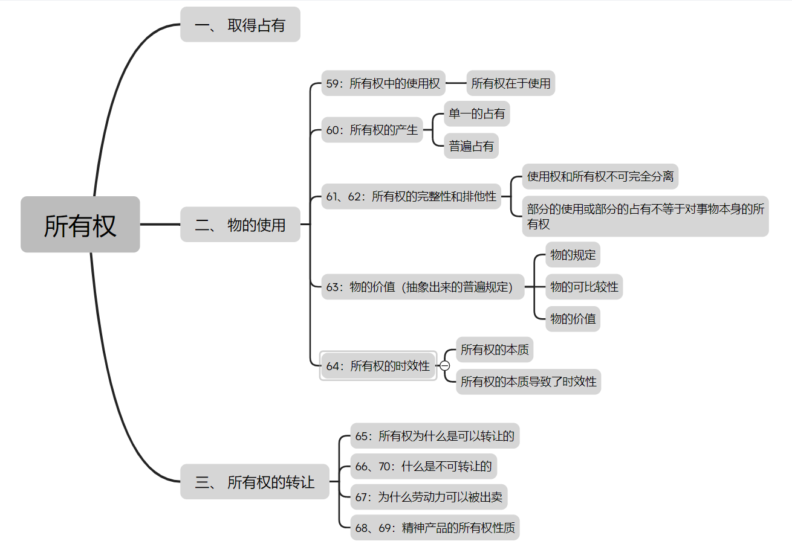

## 大纲

---

## 黑格尔的问题意识

#### 黑格尔财产权理论的前提

- 洛克：劳动者以其**身体为原初所有物**,通过**劳动将自然物转化为私人财产**。即从个体劳动中引申出财产权

- 休谟：解构洛克关于自然权利的先天预设,指认财产权本质上是“人为德性”而非“自然德性”,其合法性源于**社会成员基于共同利益感形成的约定性规则**。将财产权提高到了社会层面

- 康德：财产权并非源于经验性劳动,而是**通过普遍法权原则建构的理性秩序**,其有效性依赖于“所有自由意志的先天联合”。这种先验转向使<mark>财产权从经验性占有升格为理性主体的法权能力</mark>

#### 黑格尔的尝试

以“所有权”概念重构财产权的哲学基础,作为自由意志定在的最初形态,所有权通过“占有、使用、转让”的运动实现人格从主观性到客观性的外化，其本质是“人格在物中的扩展”，从而回答人的自由意志如何在外在物中得到现实存在的问题，进一步解答自由意志如何在外在世界中成为现实的权利关系的问题

---

## 黑格尔与国民经济学 与斯密的互动

#### 1 需要理论 59 60

物的使用：物通过物的变化、消灭和消耗满足需要。黑格尔将政治经济学中物满足人的需要抽象为需要（积极）→使用（对消极的物）→需要的实现的哲学过程，将人对物的需要解释为自由意志自我实现的方式。

#### 2 价值理论 63

使用价值——物的特殊有用性

交换价值——物之所以可以比较的普遍规定

从物的特殊使用（使用价值）和抽象的普遍性（交换价值）之间，得出价值是从具体使用中抽象出来的普遍性

#### 3 市场理论 所有权的转让部分

斯密：`分工→交换→市场`

黑格尔：`意志→放弃→转让`

---

## 参考

- [马克思对黑格尔财产权理论的重构与超越](https://kns.cnki.net/kcms2/article/abstract?v=EojayBZ0l1lCYmyINGOmbhU42Wd4vogpebxJp6aiKpb_PE7OyXBG9fnkaCZf2HGvlHIXw2WFBYn8OsgRze9kBvQ4tWPfIhGTg0RHnYp7xeqQfnlvM3qXIt7ACODcl1ErMkwS4InA-OipSN-UXAUXyxUvbYkaCYS1V3bBehJ9UjKuWquRPaugUg==&uniplatform=NZKPT&language=CHS)

- [劳动所有权何以异化为资本所有权?——从洛克、黑格尔到马克思](https://kns.cnki.net/kcms2/article/abstract?v=jpN_MAf5WI5Y42YhjSQL42r2stKlftDZYIfBgqQMWGf8RemtrxQXlIWuo-hY2lJOVWAfv7hFmZMlJ2vDJBiO2AEiA5BJX7e7acbQKbN4qU2JS5d0ve1gj331GkL0FLuuZCAdm0ARAsP8kdqNdNscJPLEZudoOihFB5A94I7255Q4w9OzHPTkXw==&uniplatform=NZKPT&language=CHS)